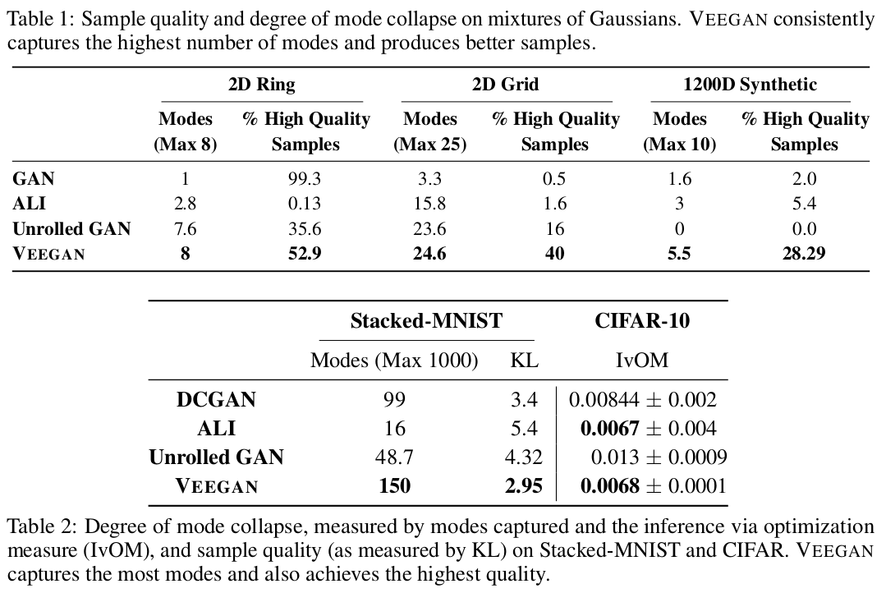
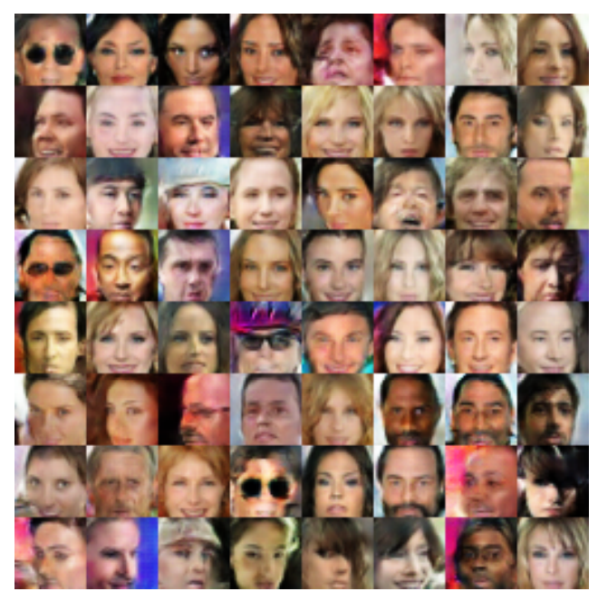

# Abstract
Deep generative models provide powerful tools for distributions over complicated manifolds, such as those of natural images. But many of these methods, including generative adversarial networks (GANs), can be difficult to train, in part because they are prone to mode collapse, which means that they characterize only a few modes of the true distribution. To address this, we introduce VEEGAN, which features a reconstructor network, reversing the action of the generator by mapping from data to noise. Our training objective retains the original asymptotic consistency guarantee of GANs, and can be interpreted as a novel autoencoder loss over the noise. In sharp contrast to a traditional autoencoder over data points, VEEGAN does not require specifying a loss function over the data, but rather only over the representations, which are standard normal by assumption. On an extensive set of synthetic and real world image datasets, VEEGAN indeed resists mode collapsing to a far greater extent than other recent GAN variants, and produces more realistic samples.

# Learning In Implicit Models
Deep generative models that do not induce a density function that can be tractably computed, but rather provide a simulation procedure to generate new data points are called implicit statistical models. Generative adversarial networks (GANs) are an attractive such method, which have seen promising recent successes. GANs train two deep networks in concert: a generator network that maps random noise, usually drawn from a multi-variate Gaussian, to data items; and a discriminator network that estimates the likelihood ratio of the generator network to the data distribution, and is trained using an adversarial principle

# Mode Collapsing Issue in GANs
Despite an enormous amount of recent work, GANs are notoriously fickle to train, and it has been observed that they often suffer from mode collapse, in which the generator network learns how to generate samples from a few modes of the data distribution but misses many other modes, even though samples from the missing modes occur throughout the training data.

# VEEGAN
To address this issue, we introduce VEEGAN, a variational principle for estimating implicit probability distributions that avoids mode collapse. While the generator network maps Gaussian random noise to data items, VEEGAN introduces an additional reconstructor network that maps the true data distribution to Gaussian random noise. We train the generator and reconstructor networks jointly by introducing a implicit variational principle, which involves a novel upper bound on the cross-entropy between the reconstructor network and the original noise distribution of the GAN. Our objective function combines the traditional discriminator with an autoencoder of the noise vectors — thus providing an additional, complementary learning signal that avoids mode collapse.

# VEEGAN and VAE+GAN
Unlike other adversarial methods that train reconstructor networks, the noise autoencoder dramatically reduces mode collapse. Unlike recent adversarial methods that also make use of a data autoencoder, VEEGAN autoencodes noise vectors rather than data items. This is a significant difference, because choosing an autoencoder loss for images is problematic, but for Gaussian noise vectors, an $$l_2$$ loss is entirely natural. Experimentally, on both synthetic and real-world image data sets, we find that VEEGAN is dramatically less susceptible to mode collapse, and produces higher-quality samples, than other state-of-the-art methods.

# Experiments
 
## Synthetic Dataset

## Stacked MNIST

## CIFAR

## CelebA

## Inference

# Acknowledgement
We thank Martin Arjovsky, Nicolas Collignon, Luke Metz, Casper Kaae Sønderby, Lucas Theis, Soumith Chintala, Stanisław Jastrz˛ebski, Harrison Edwards and Amos Storkey for their helpful comments. We would like to specially thank Ferenc Huszár for insightful discussions and feedback.
