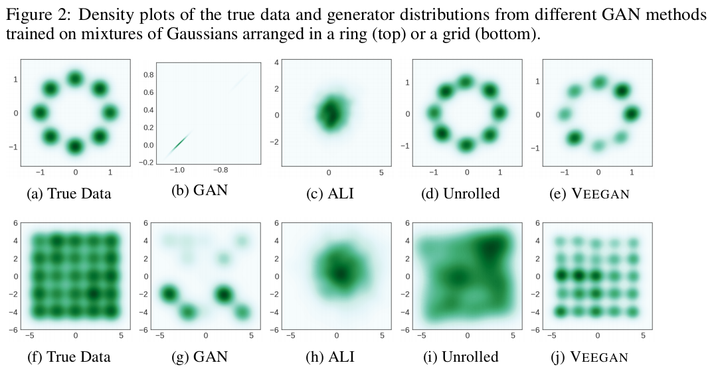
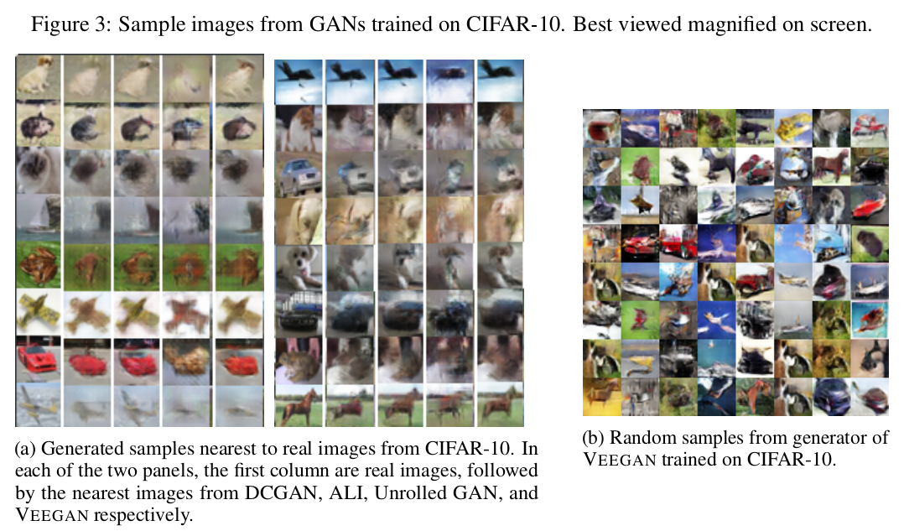

# Introduction
Deep generative models provide powerful tools for distributions over complicated manifolds, such as those of natural images. But many of these methods, including generative adversarial networks (GANs), can be difficult to train, in part because they are prone to mode collapse, which means that they characterize only a few modes of the true distribution. To address this, we introduce VEEGAN, which features a reconstructor network, reversing the action of the generator by mapping from data to noise. Our training objective retains the original asymptotic consistency guarantee of GANs, and can be interpreted as a novel autoencoder loss over the noise. In sharp contrast to a traditional autoencoder over data points, VEEGAN does not require specifying a loss function over the data, but rather only over the representations, which are standard normal by assumption. On an extensive set of synthetic and real world image datasets, VEEGAN indeed resists mode collapsing to a far greater extent than other recent GAN variants, and produces more realistic samples.

# Method

# Experiments

## Synthetic Dataset

## Stacked MNIST

## CIFAR

## CelebA

## Inference

# Acknowledgement

