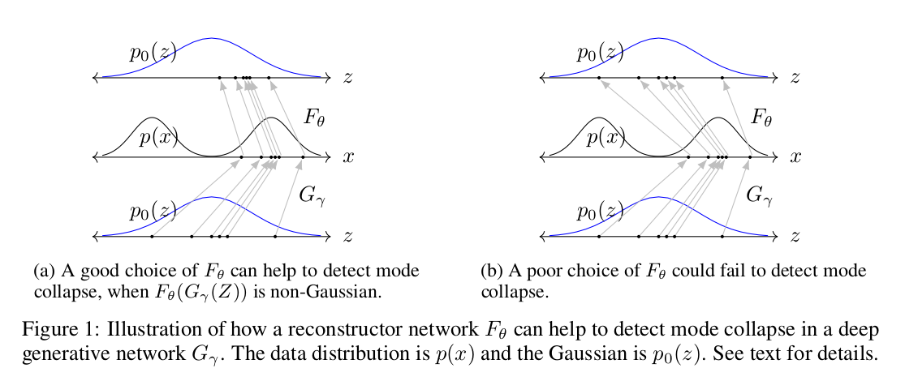
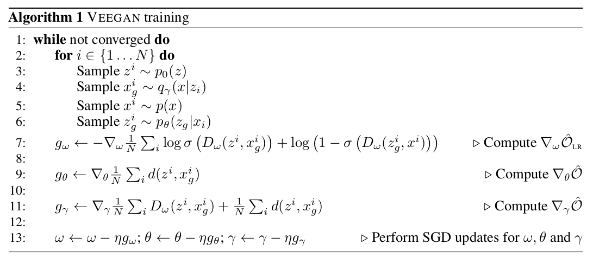

# Learning In Implicit Models
Deep generative models that do not induce a density function that can be tractably computed, but rather provide a simulation procedure to generate new data points are called implicit statistical models. Generative adversarial networks (GANs) are an attractive such method, which have seen promising recent successes. GANs train two deep networks in concert: a generator network that maps random noise, usually drawn from a multi-variate Gaussian, to data items; and a discriminator network that estimates the likelihood ratio of the generator network to the data distribution, and is trained using an adversarial principle

More formally, let $$\{x_i\}_{i=1}^N$$ denote the training data, where each $$x_i \in \mathbb{R}^D$$ is drawn from an unknown
distribution $$p(x)$$. A GAN is a neural network $$G_\gamma$$ that maps representation vectors $$z \in \mathbb{R}^K$$, typically drawn from a standard normal distribution, to data items $$x \in \mathbb{R}^D$$. Because this mapping defines an implicit probability distribution, training is accomplished by introducing a second neural network $$D_\omega$$, called a discriminator, whose goal is to distinguish samples from the generator to those from the data. The parameters of these networks are estimated by solving the minimax problem

$$\max_\omega \min_\gamma O_{\text{gan}} (\omega, \gamma) := E_z [\log \sigma \left(D_\omega(G_\gamma (z))\right)]  + E_x [ \log\left( 1-\sigma \left(D_\omega(x)\right)\right)]$$,

where $$E_z$$ indicates an expectation over the standard normal $$z$$, $$E_x$$ indicates an expectation over the empirical distribution, and $$\sigma$$ denotes the sigmoid function. At the optimum, in the limit of infinite data and arbitrarily powerful networks, we will have $$D_\omega = \log q_\gamma(x)/p(x)$$, where $$q_\gamma$$ is the density that is induced by running the network $$G_\gamma$$ on normally distributed input, and hence that $$q_\gamma = p$$.

# Mode Collapsing Issue in GANs
Despite an enormous amount of recent work, GANs are notoriously fickle to train, and it has been observed that they often suffer from mode collapse, in which the generator network learns how to generate samples from a few modes of the data distribution but misses many other modes, even though samples from the missing modes occur throughout the training data.

That is samples from $$q_\gamma(x)$$ capture only a few of the modes of $$p(x)$$. An intuition behind why mode collapse occurs is that the only information that the objective function provides about $$\gamma$$ is mediated by the discriminator network $$D_\omega$$. For example, if $$D_\omega$$ is a constant, then $$O_{\text{gan}}$$ is constant with respect to $$\gamma$$, and so learning the generator is impossible. When this situation occurs in a localized region of input space, for example, when there is a specific type of image that the generator cannot replicate, this can cause mode collapse.

# VEEGAN

To address this issue, we introduce VEEGAN, a variational principle for estimating implicit probability distributions that avoids mode collapse. While the generator network maps Gaussian random noise to data items, VEEGAN introduces an additional reconstructor network that maps the true data distribution to Gaussian random noise. We train the generator and reconstructor networks jointly by introducing a implicit variational principle, which involves a novel upper bound on the cross-entropy between the reconstructor network and the original noise distribution of the GAN. Our objective function combines the traditional discriminator with an autoencoder of the noise vectors — thus providing an additional, complementary learning signal that avoids mode collapse.

The main idea of VEEGAN is to introduce a second network $$F_\theta$$ which we call the __reconstructor__, which learns the reverse feature mapping from data items $$x$$ to representations $$z$$. To understand why this might prevent mode collapse, consider the example in Figure 1. In both columns of the figure, the middle vertical panel represents the data space, where in this example the true distribution $$p(x)$$ is a mixture of two Gaussians. The bottom panel depicts the input to the generator, which is drawn from a standard normal distribution, and depicts the action of the generator network $$G_\gamma$$. In this example, the generator has captured only one of the two modes of $$p(x)$$. Now, starting from Figure 1a,
we might intuitively hope that because the generated data points are highly concentrated in data space, $$F_\theta$$ will map them to a small range in representation space, as shown in the top panel of Figure 1a. This would then allow us to detect mode collapse, and hence provide a learning signal for $$\gamma$$, because the points in representation space do not appear to be drawn from a standard normal.

However, if we wish to detect mode collapse, we must choose $$F_\theta$$ carefully. In this example, a poor choice of $$F_\theta$$ is shown in Figure 1b. Now applying $$F_\theta \circ G_\gamma$$ to the generator input returns samples that appear to be drawn from a standard normal, so $$F_\theta$$ is no help in detecting this example of mode collapse. To address this problem, we need an appropriate learning principle for $$\theta$$, which we introduce now as an algorithm.

$$-\int p_0(z) \log p_\theta(z) \leq O(\gamma, \theta)$$

$$O(\gamma, \theta) = KL{q_\gamma(x|z) p_0(z)}{p_\theta(z|x)p(x)} - E[\log p_0(z)] + E[d(z, F_\theta(x))]$$

where all expectations are taken with respect to the joint distribution $$p_0(z)q_\gamma(x|z)$$. 

TODO: finish this section.

# VEEGAN and VAE+GAN
Unlike other adversarial methods that train reconstructor networks, the noise autoencoder dramatically reduces mode collapse. Unlike recent adversarial methods that also make use of a data autoencoder, VEEGAN autoencodes noise vectors rather than data items. This is a significant difference, because choosing an autoencoder loss for images is problematic, but for Gaussian noise vectors, an $$l_2$$ loss is entirely natural. Experimentally, on both synthetic and real-world image data sets, we find that VEEGAN is dramatically less susceptible to mode collapse, and produces higher-quality samples, than other state-of-the-art methods.

# Experiments
 
## Synthetic Dataset

## Stacked MNIST

## CIFAR

## CelebA

## Inference

# Acknowledgement
We thank Martin Arjovsky, Nicolas Collignon, Luke Metz, Casper Kaae Sønderby, Lucas Theis, Soumith Chintala, Stanisław Jastrz˛ebski, Harrison Edwards and Amos Storkey for their helpful comments. We would like to specially thank Ferenc Huszár for insightful discussions and feedback.
